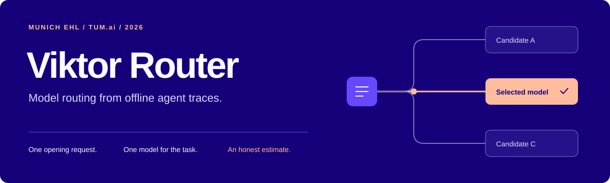
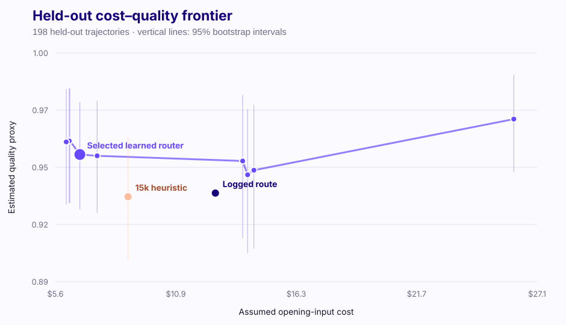

[Results](#the-result) · [Try it](#try-it) · [How it works](docs/methodology.md) · [Reproduce the analysis](docs/reproducing.md)

# Viktor Router

Which model does an agent actually need for a task?

Built for the **Viktor Challenge at the Munich EHL hackathon**, this project routes
an opening request to a model based on expected workload, execution risk, and
cost. The interesting part was evaluating it: the logs only show what happened
with the model that ran, and the final answers are missing.

The result is a small, offline router and an evaluation that makes those gaps
explicit. The routing and training code uses only the Python standard library.

## The result

The saved hackathon run estimated **47.6% lower opening-input cost** on 198 held-out
trajectories. The estimated change in the quality proxy was **+0.0179**, with a
95% interval of **[−0.0075, +0.0422]**. That interval includes both a small loss and
a gain; it does not establish a quality improvement.



<sub>Saved analysis: 1,000 requests, 991 usable quality labels, 198 test trajectories.
Prices are assumptions; tokens are estimated. Cost covers opening input only,
not the full task or output tokens. The effective overlap sample size is 54.2.</sub>

The [evaluation notebook](notebooks/03_router_frontier_and_ope.ipynb) includes the
frontier, weight-clipping checks, and sensitivity to the assumed model mappings.
These are archived results, not a production benchmark.

## How it works

1. **Recover the task context.** Group requests by their opening messages and
   audit collisions. Later request histories provide observable tool outcomes.
2. **Predict workload and risk.** Two ridge-regression heads use only information
   available at the opening decision: task text, context size, and available tools.
3. **Choose a model.** Estimate quality for candidates with comparable historical
   support. Pick the cheapest within a validation-selected tolerance of the best
   prediction; use a fixed Sonnet fallback when none has support.
4. **Check the trade-off.** Hold out entire task templates and compare policies
   using a stabilized doubly robust estimate, bootstrap intervals, and overlap checks.

The chosen model stays fixed for the trajectory. A separate cost model accounts
for shared-prefix caching and the reset caused by switching models.
[Method and limitations →](docs/methodology.md)

## Try it

From the repository root, with Python 3.10 or newer:

```bash
python3 scripts/route_request.py examples/request.json
```

This runs the included trained router on a **synthetic request**. It prints the
chosen model, predictions, and whether historical support or the fallback drove
the decision. No dataset, package installation, or API key is needed. Small
handwritten examples can fall outside the training data's support; the fallback
is part of the policy.

Edit [the example](examples/request.json) to try another opening request. No LLM
is called and the request is not executed.

To rebuild the experiment with an authorized copy of the challenge data:

```bash
make pipeline
```

See [reproduction instructions](docs/reproducing.md) for data layout, individual
commands, and the difference between the saved results and a new run.

## Explore the project

| Start here | What it contains |
| :--- | :--- |
| [01 · Data and labels](notebooks/01_data_and_label_audit.ipynb) | Task mix, model coverage, and what can be judged from the logs |
| [02 · Workload and quality](notebooks/02_complexity_and_quality_diagnostics.ipynb) | Prediction diagnostics and uncertainty |
| [03 · Frontier and evaluation](notebooks/03_router_frontier_and_ope.ipynb) | Cost–quality trade-off and off-policy sensitivity |
| [scripts/](scripts/) | Reconstruction, feature extraction, training, routing, and evaluation |
| [models/](models/) | Saved router and the assumed capability profiles |
| [docs/](docs/) | Method, reproduction notes, and README figures |

The notebooks include saved outputs for browsing without the data. The original
challenge briefing lives in [AGENTS.md](AGENTS.md); `skills/` and `templates/`
contain the supplied presentation and submission scaffolding.

## Data

The trajectory export is **challenge use only** and is not distributed here.
Raw data belongs in `export/`; generated tables and local reports belong in
`results/`. Both are ignored by Git. Neither should be uploaded or committed.
