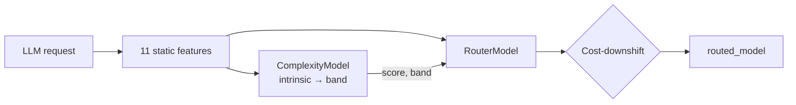

# Team Router — Model Architecture

A **two-stage, routing-time-only** model router for the Viktor Challenge (Munich EHL 2026).  
Predicts task complexity from static text, then applies a **cost-downshift policy** to pick a model id for the whole trajectory.

**Constraints:** stdlib only, offline on a laptop, one model per trajectory at inference.


---

## Pipeline



---

## Stage 1: ComplexityModel

At routing time only **intrinsic** complexity is used (`routing=True`):

```
complexity_score = mean(5 intrinsic components)   # 0–100
band:  < 40 → low  |  < 70 → medium  |  else high
```

11 static features from `datasets/*_inputs.jsonl` (or extracted from raw request).

---

## Stage 2: RouterModel — cost-downshift

1. **low** → `gpt-5.6-terra`
2. **medium / high** → downshift to `claude-sonnet-5` if cheaper than logged
3. **Classifier** → only if confident **and** cheaper than logged
4. Otherwise → **keep logged model** (never upgrade tier)

---

## Training (official splits)

| Stage | Source | n |
|-------|--------|---|
| Complexity train | `train_inputs` + `train_targets` | **700** |
| Complexity eval | `validation` | 154 |
| Router train | train `request_id`s in export, **minus val/test** | **505** |
| Router tune | `validation` (confidence threshold) | 154 |
| Quality kNN / match table | `train_targets` | 700 |

```bash
python team/model/train.py
python team/model/predict.py export/
python team/eval/evaluate.py --split both
```

---

## Results (cache-aware input cost, output excluded)

### Cost–quality

| Split | n | Team cost Δ | Team quality Δ | Baseline cost Δ | Baseline quality Δ |
|-------|---|-------------|----------------|-----------------|-------------------|
| **Validation** | 154 | **−18.6%** | +0.011 | −15.1% | +0.024 |
| **Test** | 148 | **−26.1%** | −0.017 | −12.8% | +0.027 |

### Complexity model

| Split | Score MAE | Band accuracy |
|-------|-----------|---------------|
| Validation | 11.68 | 64.9% |
| Test | 12.96 | 54.7% |

### Full export (978 trajectories)

| Logged | Routed | Δ |
|--------|--------|---|
| $87.68 | **$46.64** | **−46.8%** |

Quality is an **off-policy estimate** (kNN + match table on train labels). Token counts are chars÷4 estimates.

---

## Layout

```
team/
├── README.md
├── model-architecture.png
├── checkpoints/model.json
├── model/          # train, predict, complexity, router, linear
└── eval/           # evaluate.py, quality.py
```

Results: `results/validation_*.json|csv`, `results/test_*.json|csv`, `results/team_routes.jsonl`

---

## Known weaknesses

1. Quality is estimated, not measured under counterfactual routing.
2. Large full-export savings assume aggressive downshifting; validation/test savings are more modest.
3. Input tokens only; output cost excluded.
4. Router does not replay Viktor’s logged model choices (~40% exact match).

---

## References

- `AGENTS.md` · `scripts/cost_model.py` · `scripts/baseline_router.py`
