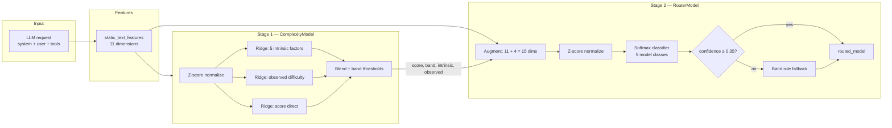
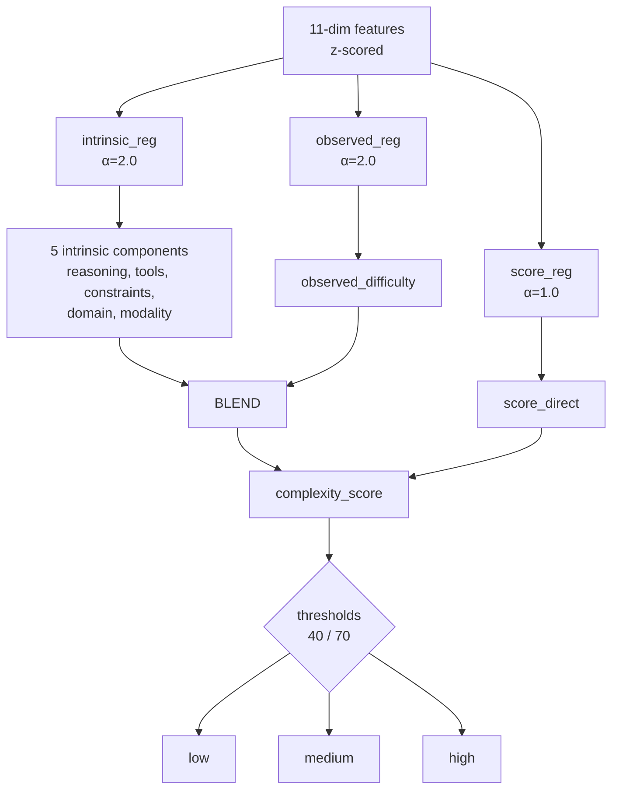
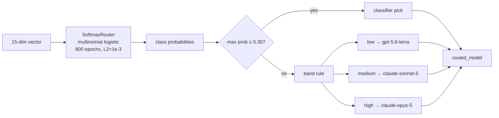
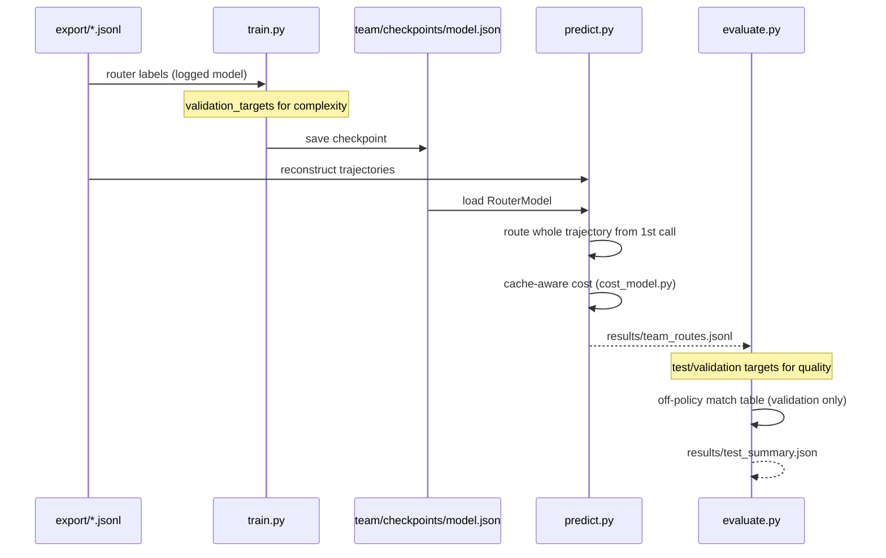

# Team Router — Model Architecture

A **two-stage, routing-time-only** model router for the Viktor Challenge. It predicts task complexity from static request text, then selects a model id. Training uses labeled complexity targets; routing mimics production Viktor logs on `export/`.

**Design constraints:** stdlib only (no numpy/sklearn), offline on a laptop, one model per trajectory at inference.


---

## High-level pipeline



At **trajectory level**, the first call’s features pick one model for the **entire trajectory** (respects the one-model-per-task premise and avoids cache-reset penalties from mid-task switches).

---

## Stage 1: ComplexityModel

Predicts how hard a task is **before execution**, aligned with the official complexity formula:

```
complexity_score ≈ (1 − w) × intrinsic_complexity + w × observed_difficulty
                  w = 0.35
```

### Inputs — 11 static features (`team/model/features.py`)

| Feature | Description |
|---------|-------------|
| `system_est_tokens` | System prompt length ÷ 4 |
| `user_est_tokens` | User text length ÷ 4 |
| `user_message_count` | Number of user messages |
| `step_marker_count` | Bullets, headings, skill markers |
| `question_count` | `?` in combined text |
| `action_term_count` | Verbs: run, create, grep, deploy, … |
| `constraint_term_count` | must, never, required, … |
| `domain_term_count` | slack, github, pdf, api, … |
| `image_count` | Image / file hints |
| `url_count` | HTTP(S) URLs |
| `code_block_count` | Markdown code fences |

When `request_id` is in `datasets/*_inputs.jsonl`, we use the official `static_text_features`; otherwise features are extracted from the raw request.

### Internal heads (3× Ridge regression)



**Score fusion at inference:**

1. `intrinsic_complexity` = mean of 5 predicted intrinsic components (scaled 0–100)
2. `score_blend` = `0.65 × intrinsic + 0.35 × observed` (predicted)
3. `complexity_score` = `0.5 × score_direct + 0.5 × score_blend`
4. **Band:** `< 40` → low, `< 70` → medium, else high

### Training labels

- **Source:** `datasets/validation_inputs.jsonl` + `validation_targets.jsonl` (154 samples)
- **Targets:** `intrinsic_components`, `observed_difficulty`, `complexity_score`, `complexity_band`
- **Holdout metric (20%):** score MAE ≈ **8.6**, band accuracy ≈ **90%**

---

## Stage 2: RouterModel

Maps complexity + static features → one of five production model ids seen in the export.

### Candidate models

| Class | Typical role |
|-------|----------------|
| `gpt-5.6-terra` | Cheaper GPT tier |
| `gpt-5.6-sol` | Mid GPT tier |
| `claude-sonnet-5` | Balanced Claude |
| `claude-opus-5` | Capable Claude |
| `claude-fable-5` | Premium Claude |

### Augmented feature vector (15 dims)

```
[11 static features] + [complexity_score, intrinsic_complexity, observed_difficulty, band_encoding]
```

`band_encoding`: low=0, medium=1, high=2 — then z-scored with the augmented vector.

### Classifier + fallback rule



### Router training

- **Source:** `export/trajectories_v1_01.jsonl` — one routing point per request line
- **Labels:** logged `model` field
- **Exclusion:** all `validation` / `test` `request_id`s removed from router training (no label leakage)
- **~846** training points after filtering

---

## End-to-end data flow



---

## Repository layout

```
team/
├── README.md                 ← this file
├── model-architecture.png    ← visual diagram
├── checkpoints/
│   └── model.json            ← trained weights
├── model/
│   ├── features.py           ← static feature extraction
│   ├── complexity.py         ← Stage 1
│   ├── router.py             ← Stage 2
│   ├── linear.py             ← Ridge + Softmax (numpy-free)
│   ├── train.py              ← training entrypoint
│   └── predict.py            ← routing + cost report
└── eval/
    ├── quality.py            ← outcome proxy + match table
    └── evaluate.py           ← holdout / test evaluation + frontier
```

---

## Quick start

```bash
# Train (complexity on validation labels, router on export minus val/test ids)
python team/model/train.py

# Route full export + cost report
python team/model/predict.py export/

# Evaluate on test set (match table from validation only)
python team/eval/evaluate.py --split test

# Evaluate validation + test
python team/eval/evaluate.py --split both
```

---

## Results summary

| Split | n | Cost Δ (team) | Quality Δ (est.) | Complexity band acc |
|-------|---|---------------|------------------|---------------------|
| Validation | 154 | **−33.1%** | +0.014 | 90.3% (train holdout) |
| Test | 148 | **−36.5%** | +0.009 | **83.8%** |
| Full export | 978 trajs | **−29.3%** | — | — |

Baseline (official starter): −15.1% cost on validation, −12.8% on test.

**Quality estimation:** mean of four `observed_components` from labeled targets; counterfactual routes use a `(complexity_band, model)` match table fit on validation. See `team/eval/quality.py` for failure modes.

---

## Known weaknesses (state in writeup)

1. **Observed difficulty is predicted from static text only** — true observed signals need post-execution traces.
2. **Router exact-match accuracy is low (~16%)** — Viktor’s logged routing is not fully explained by our features; the value is in cost–quality tradeoffs, not replaying logs.
3. **Off-policy quality** relies on a sparse match table; many cells have &lt; 3 samples.
4. **All token counts are estimates** (chars ÷ 4); output tokens are excluded from cost.

---

## References

- Challenge briefing: `AGENTS.md`
- Trajectory loading: `scripts/load_trajectories.py`
- Cache-aware pricing: `scripts/cost_model.py`
- Baseline floor: `scripts/baseline_router.py`
