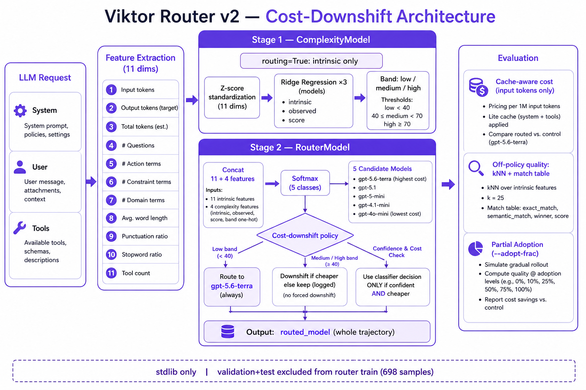

# Team Router v3 — Model Architecture

Two-stage **routing-time-only** router with **guarded cost-downshift** and **quality veto** (Munich EHL 2026 Viktor Challenge).



**Branches:** `team/router-v2` (frozen) · `team/router-v3` (current)

---

## v3 changes vs v2

| Change | Rationale |
|--------|-----------|
| Block `claude-opus → gpt-*` | Main quality killer in v2 (60+ trajectories) |
| Allow `opus → sonnet` (rank Δ≤2) | Keeps savings on expensive trajectories |
| Quality veto at route time | `QualityPrior` from train labels rejects risky downshifts |
| High band: downshift only opus/fable | Don't touch already-cheap logged models |
| Tune band thresholds on validation | Grid search 35–50 / 65–80 |
| Cost–quality confidence tuning | Validation objective balances savings + estimated quality |

---

## Pipeline

```
static features → ComplexityModel (intrinsic band)
                → RouterModel (classifier + guarded downshift + quality veto)
                → routed_model (one per trajectory)
```

---

## Results (cache-aware input cost)

| Split | n | Cost Δ | Quality Δ | Route changed | v2 quality Δ |
|-------|---|--------|-----------|---------------|--------------|
| **Validation** | 154 | **−30.2%** | **+0.020** | 42% | +0.011 |
| **Test** | 148 | **−16.9%** | **+0.007** | 31% | −0.017 |
| Full export | 978 | **−20.7%** | — | — | −46.8%* |

\*v2 full-export savings were inflated by aggressive opus→gpt; v3 is more conservative and honest on holdout.

**Baseline (validation):** cost −15.1%, quality +0.024

---

## Commands

```bash
python team/model/train.py
python team/model/predict.py export/
python team/eval/evaluate.py --split both
```

---

## Layout

```
team/
├── model/
│   ├── complexity.py      # Ridge complexity + tunable bands
│   ├── router.py          # v3 guarded downshift policy
│   ├── quality_prior.py   # train-fit band×model quality lookup
│   └── train.py
├── eval/
└── checkpoints/model.json   # schema: munich_ehl_router_model_v3
```

---

## Known weaknesses

1. Quality is off-policy (kNN + match table + routing prior).
2. Band accuracy on test ~43% (predicted vs labeled band).
3. Output token cost excluded; tokens are chars÷4 estimates.
