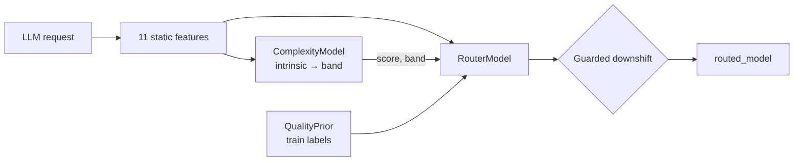

# Viktor Router v3 — Guarded Cost-Downshift

Two-stage, **routing-time-only** model router for the Munich EHL 2026 Viktor Challenge.  
Predicts task complexity from static text, then applies a **guarded downshift policy** with a **quality veto** to pick one model id for the whole trajectory.

**Branch:** `team/router-v3` · frozen v2: `team/router-v2`


---

## Design goal

Move along the **cost–quality frontier**: save money on trajectories where downshifting is safe, keep the logged model everywhere else. v3 fixes v2's main failure mode — aggressive `claude-opus → gpt-*` routes that hurt test quality.

---

## Pipeline



---

## Stage 1 — ComplexityModel

At routing time only **intrinsic** complexity is used (`routing=True`):

```
complexity_score = mean(5 intrinsic components)   # 0–100
band:  < 35 → low  |  < 80 → medium  |  else high   # tuned on validation
```

| Component | Source |
|-----------|--------|
| 11 static features | `static_text_features` in `datasets/*_inputs.jsonl` |
| Ridge ×3 | intrinsic components, observed difficulty, score |
| Band thresholds | grid search on validation (accuracy − MAE/100) |

---

## Stage 2 — RouterModel

**Inputs:** 11 features + 4 complexity features → Softmax over 5 production models.

**Decision order** (`router.py`):

| Step | Rule |
|------|------|
| 1 | **low** → `gpt-5.6-terra` |
| 2 | **classifier** → only if confidence ≥ threshold **and** cheaper than logged |
| 3 | **medium / high** → `claude-sonnet-5` if cheaper than logged |
| 4 | **high** → band downshift only when logged tier is opus or fable |
| 5 | **Guards** — block `claude-opus → gpt-*`; max rank Δ ≤ 2 (allows `opus → sonnet`) |
| 6 | **Quality veto** — reject candidate if `QualityPrior` estimates quality drop > 0.025 |
| 7 | else → **keep logged model** (never upgrade tier) |

`QualityPrior` is a `band × model` lookup fit on **700 train labels** (with model/global fallback).

---

## Training splits

| Stage | Data | n |
|-------|------|---|
| Complexity train | `train_inputs` + `train_targets` | 700 |
| Complexity tune | validation (band thresholds) | 154 |
| Router train | train `request_id`s in export, **minus val/test** | 505 |
| Router tune | validation (confidence threshold) | 154 |
| Quality prior + kNN / match table | `train_targets` | 700 |

```bash
python team/model/train.py
python team/model/predict.py export/
python team/eval/evaluate.py --split both
python team/eval/explain_report.py --split both   # per-model / per-reason breakdown
```

Checkpoint: `team/checkpoints/model.json` · schema `munich_ehl_router_model_v3`

### Explainability outputs (`results/explain_*`)

| File | Content |
|------|---------|
| `explain_{split}.json` | Overall + by model / reason / band + transitions |
| `explain_{split}_rows.csv` | Per-trajectory: cost, quality, `route_reason`, top feature |
| `explain_{split}_by_model.csv` | Aggregated cost & quality per **routed model** |
| `explain_{split}_by_reason.csv` | Aggregated per **route_reason** |
| `explain_{split}_transitions.csv` | `logged_model → routed_model` matrix |

Each row includes **Ridge feature attribution** (top-5 features pushing complexity score) and **QualityPrior** estimates (`prior_logged` vs `prior_routed`).

---

## Results

Cache-aware **input** cost (output excluded). Quality is an **off-policy estimate** (kNN + match table on train).

### Cost–quality (v3 vs v2)

| Split | n | v3 cost Δ | v3 quality Δ | v2 quality Δ | Route changed |
|-------|---|-----------|--------------|--------------|---------------|
| **Validation** | 154 | **−30.2%** | **+0.020** | +0.011 | 42% |
| **Test** | 148 | **−16.9%** | **+0.007** | −0.017 | 31% |
| Full export | 978 | **−20.7%** | — | — | — |

**Baseline (validation):** cost −15.1%, quality +0.024

v3 trades some full-export savings (v2 was −46.8%) for **positive test quality** and more honest holdout behavior.

### Complexity model (labeled band vs predicted)

| Split | Score MAE | Band accuracy |
|-------|-----------|---------------|
| Validation | 11.68 | 47% |
| Test | 12.96 | 43% |

Eval CSVs now include `predicted_band`, `predicted_score`, and `route_reason` alongside ground-truth labels.

---

## Evaluation

`team/eval/evaluate.py` reports per-split summaries to `results/validation_*` and `results/test_*`:

- **Cost:** `scripts/cost_model.py` — cache-aware input pricing, chars÷4 token estimates
- **Quality:** `team/eval/quality.py` — kNN over train features + `band×model` match table
- **Frontier:** `adopt_frac` sweep (adopt highest-savings routes first)

**Failure modes we name:**
- Match table built from train only; sparse cells fall back to model/global mean
- Routed ≠ logged assumes quality depends on band + model, not unobserved task factors
- Output tokens excluded from cost

---

## Layout

```
team/
├── README.md
├── model-architecture.png
├── checkpoints/model.json
├── model/
│   ├── complexity.py       # Ridge + tunable bands
│   ├── router.py           # v3 guarded policy
│   ├── quality_prior.py    # routing-time quality veto
│   ├── explain.py          # feature attribution + decision trace
│   ├── features.py         # 11 static dims
│   ├── linear.py           # Ridge + Softmax (stdlib)
│   ├── train.py
│   └── predict.py
└── eval/
    ├── evaluate.py
    ├── explain_report.py   # interpretability breakdown
    └── quality.py
```

---

## Related repo tools

- `scripts/model_catalog.py` — benchmark-anchored capability index (merged from `main`)
- `scripts/baseline_router.py` — small-trajectory heuristic floor
- `AGENTS.md` — challenge briefing

---

## Known weaknesses

1. Band accuracy ~43% on test — routing uses **predicted** band, eval CSV also shows **labeled** band.
2. Quality is estimated, not measured under counterfactual routing.
3. Input tokens only; token counts are chars÷4 estimates.
4. Validation savings exceed test — possible split distribution shift.
